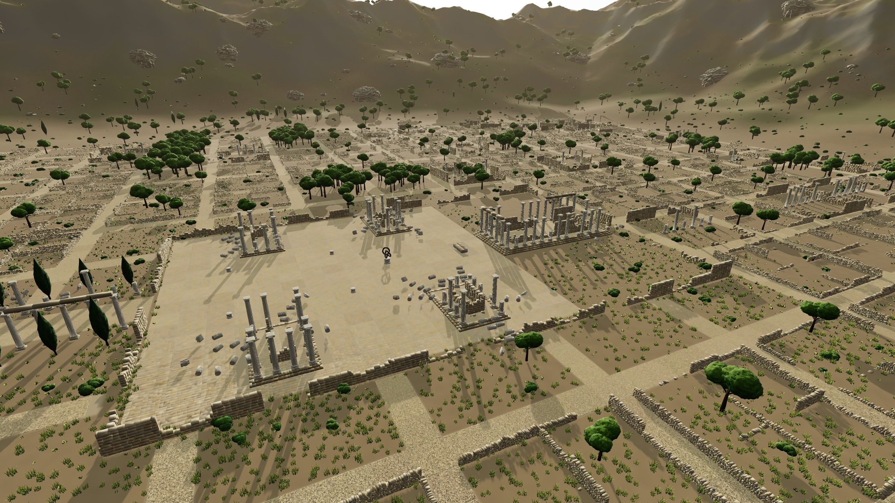
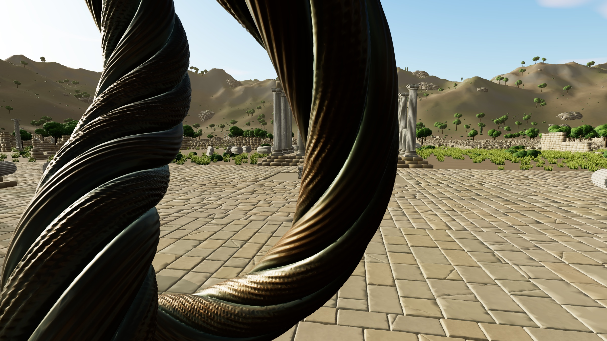
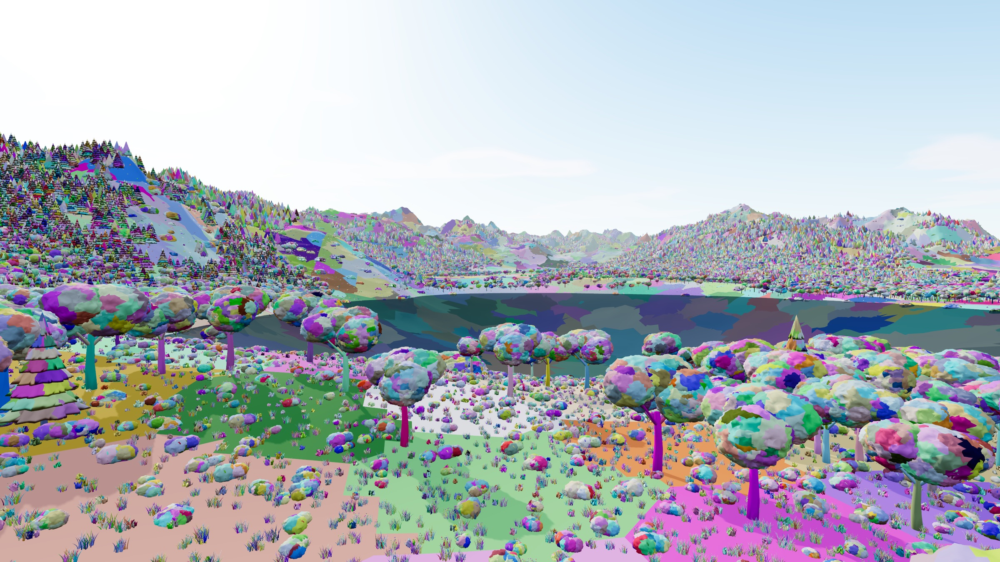
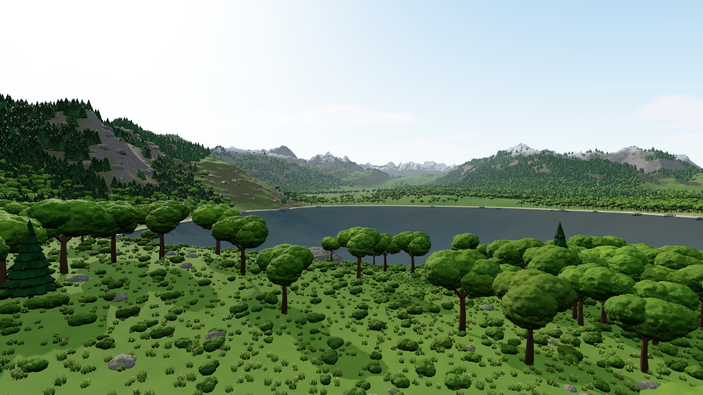
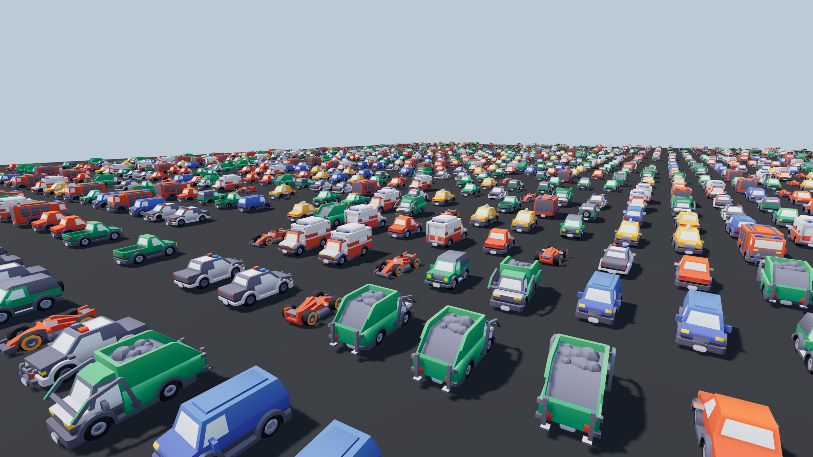

# three-virtual-geometry

**Virtual geometry for three.js WebGPU.** Put in your models at full detail. The engine draws only the triangles
you can see: about one per pixel, wherever you are.

[**Live demo**](https://elad12390.github.io/three-virtual-geometry/live) ·
[**Docs**](https://elad12390.github.io/three-virtual-geometry/) ·
[API](https://elad12390.github.io/three-virtual-geometry/api) ·
[Set it up with your AI agent](#set-it-up-with-your-ai-agent)



| | |
| --- | --- |
|  |  |
|  |  |

- **One line to adopt.** `await vg.add(gltf.scene)` converts every static mesh, with its materials and textures.
- **Billions of triangles.** The ruins scene holds 5.7 billion and draws 7 to 9 million a frame, at 160 to 230 FPS
  at 1080p on a MacBook Pro (M4 Pro).
- **No visible LOD switching.** Detail changes cluster by cluster, below one pixel of error. No hand-made LODs.
- **GPU-driven.** Frustum, size and occlusion culling and level selection run in compute shaders. One draw call
  per mesh, millions of instances.
- **Everything three.js.** Node materials, lights, shadows, fog and tone mapping work unchanged.

## Benchmarks

Uncapped frame rates (no vsync) on a MacBook Pro with an M4 Pro, Chrome 154, 1 px error threshold, shadows on.
Ranges span several camera views per scene. [Details and how to run them](https://elad12390.github.io/three-virtual-geometry/guide/performance#benchmarks):
`npm run bench`.

| Scene | Full-detail triangles | Instances | Drawn per frame | FPS at 1080p | FPS at 4K |
| --- | --- | --- | --- | --- | --- |
| Ruins | 5.7B | 113k | 6.5M – 9.0M | 160 – 230 | 103 – 158 |
| World (6 km) | 37.5B | 3.0M | 8.3M – 9.1M | 147 – 150 | 101 – 120 |
| Valley (2 km) | 1.1B | 152k | 3.1M – 8.6M | 159 – 329 | 109 – 203 |
| glTF import | 5.1M | 12k | 0.5M – 0.6M | 941 – 964 | 468 – 516 |
| Stress, 1M instances | 39.5B | 1.0M | 0.6M – 8.4M | 177 – 1,404 | 154 – 696 |

## Install

```bash
npm install three-virtual-geometry three
```

Needs three.js r180+ and a browser with WebGPU (Chrome or Edge 113+, Safari 26+, Firefox 141+ on Windows).

## Use it

```ts
import * as THREE from 'three/webgpu';
import { GLTFLoader } from 'three/addons/loaders/GLTFLoader.js';
import { VirtualGeometry } from 'three-virtual-geometry';

const renderer = new THREE.WebGPURenderer({ antialias: true });
await renderer.init();

const vg = new VirtualGeometry();
const gltf = await new GLTFLoader().loadAsync('level.glb');
await vg.add(gltf.scene);   // every static mesh becomes virtual geometry, in place
scene.add(gltf.scene);

renderer.setAnimationLoop(() => renderer.render(scene, camera)); // render as usual
```

That's the whole integration. Repeated props are instanced automatically, builds are cached in the browser, and
level of detail and culling run before every render. Everything else is an optional lever:

```ts
vg.errorThreshold.value = 1.5;          // coarser and faster (pixels of error, default 1)
vg.triangleBudget = 6_000_000;          // or adapt detail to a budget (off by default)
grass.maxDrawDistance = 400;            // per mesh: stop drawing small clutter far away
```

Geometry made in code works too:

```ts
const data = await buildVirtualMeshCached(fromBufferGeometry(geometry));
scene.add(vg.createMesh(data, material, { matrices })); // 16 floats per instance
```

See the [guide](https://elad12390.github.io/three-virtual-geometry/guide/getting-started) for importing,
instancing, settings, baking `.vgeo` files with `npx vg-bake`, and performance tips.

## Set it up with your AI agent

Paste this into Claude Code, Cursor, Copilot or any coding agent, in your project:

```text
Add three-virtual-geometry (https://github.com/elad12390/three-virtual-geometry) to this project so that every
static mesh is rendered as virtual geometry. Read https://elad12390.github.io/three-virtual-geometry/llms.txt first.
Install it, make sure the renderer is THREE.WebGPURenderer from 'three/webgpu' (await renderer.init()), create one
VirtualGeometry, and call await vg.add(model) for each loaded model before adding it to the scene. Keep the render
loop, materials, lights and shadows as they are. Run the app and confirm there are no console errors.
```

[More on agent setup](https://elad12390.github.io/three-virtual-geometry/guide/ai-agents) · [llms.txt](docs/public/llms.txt)
· [AGENTS.md](AGENTS.md) (for agents working on this repository).

## How it works

Each mesh is split into clusters of up to 128 triangles, which are grouped, simplified with locked borders, and
split again, level by level, into a hierarchy where every cluster knows its own error and its parent's. Every frame,
compute shaders pick, per instance and per cluster, the version whose error projects to under a pixel. Because
errors grow monotonically up the hierarchy, the selection never has cracks. Many meshes share pooled buffers, so
the per-frame cost doesn't grow with the number of unique meshes.
[Read more](https://elad12390.github.io/three-virtual-geometry/guide/how-it-works).

## Run the demos locally

```bash
git clone https://github.com/elad12390/three-virtual-geometry && cd three-virtual-geometry
npm install
npm run dev     # http://localhost:8090/?scene=ruins (also map, world, import, stress, test)
npm test        # build invariants, partitioner, file format and import tests (Node)
```

## Limitations

- Static meshes (no skinning or morph targets); instances can move. Skinned meshes are left as normal three.js meshes.
- One UV channel. Hardware rasterization only (no software rasterizer for pixel-sized triangles).
- Occlusion culling needs a perspective camera with standard depth; it turns itself off otherwise.

## About this project

This is an independent, open-source implementation of *virtual geometry* (a cluster LOD hierarchy selected per
frame on the GPU), the rendering technique popularized by Nanite. It is written from scratch in TypeScript for
three.js, based on public descriptions of the technique and on the MIT-licensed
[nanite-webgpu](https://github.com/Scthe/nanite-webgpu) by Marcin Matuszczyk.

- It contains no source code, shaders, binaries or assets from Epic Games or their engine, and nothing in it is
  derived from their code or compiled code.
- It is not affiliated with, endorsed by or sponsored by Epic Games, Inc. "Nanite" is a trademark of Epic Games,
  Inc., used here only to name the technique.

Built on [three.js](https://threejs.org) and [meshoptimizer](https://github.com/zeux/meshoptimizer). The demo's
cars are the [Kenney Car Kit](https://kenney.nl/assets/car-kit) (CC0). See [THIRD_PARTY_NOTICES.md](THIRD_PARTY_NOTICES.md).

## License

[MIT](LICENSE) © 2026 Elad Ben-Haim
